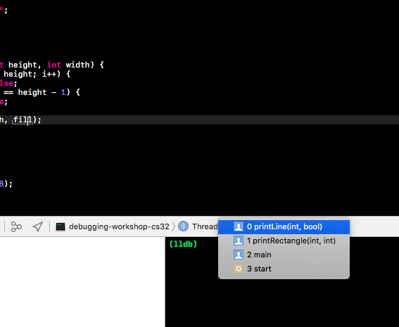

# Debugging Workshop

## Why do we need a debugger?
We could just stare at the code, but this might take a long time (or possibly forever).
We could also use print statements. But this lacks many of the useful features of a debugger, which include:
* Stepping through the code line by line
* Stopping the program at particular points called breakpoints
* Inspecting the value of variables at those points

## Breakpoints
Stop the program at places where you might think there is a problem. Click next to the line number to set a breakpoint at that line. You can disable the breakpoint by clicking again.


If we run our code with debugging, the program will stop right **before** running the line of code that we set our breakpoint to. 
For example, if we have the following:
```cpp
bool fill = false;
fill = true; // breakpoint set here
```
When our program stops at the breakpoint, the second line has not run yet. So the value of `fill` is still `false` until we continue or step to the next line. 

## What can we see once we've stopped at a line?
* Values of variables
  * There should be a box at the bottom that tells you the value of variables in the current scope. You can also hover over variables in your program to get the value. No more print statements whew!
  
  
* Stack
  * You can see what function(s) you're inside of. 
  
  
  
## Continue
To continue to the next breakpoint, click "continue." Everything in between will be run, but you don't stop at each line. 


For example, if we are at the first breakpoint in the following code snippet and we click "continue," we will run the code until the second breakpoint where we stop.
```cpp
void printRectangle(int height, int width) {
    for (int i = 0; i < height; i++) {
        bool fill = false;
        if (i == 0 || i == height - 1) { // first breakpoint set here
            fill = true;
        }
        printLine(width, fill); // second breakpoint set here
    }
}
```

##  Step into
To run each line of code one by one, click "step into."


If you come to a line where you call a function, "step into" will take you into that function and start at that function's first line.
For example, if we are in `printRectangle` and we step into `printLine`, we will stop at the first line of `printLine`.
```cpp
void printLine(int width, bool fill) {
    for (int i = 0; i < width; i++) { // this is where we will stop if we step into printLine
        if (i != 0 && i != width && !fill) {
            cout << " ";
        } else {
            cout << "*";
        }
    }
    cout << endl;
}

void printRectangle(int height, int width) {
    for (int i = 0; i < height; i++) {
        bool fill = false;
        if (i == 0 || i == height - 1) {
            fill = true;
        }
        printLine(width, fill); // breakpoint set here
    }
}
```
With breakpoints, "continue," and "step into," you can already step through your program and see how variables change. The next features are ones you can use to step through your program more quickly. There are also even more features of debuggers but these are the ones we think you might use. 

## Step over


If you come to a line where you call a function, "step over" will continue until after that function has finished being run. 
For example, if we are in `printRectangle` and we step over `printLine`, we will continue to the top of the for loop to check the condition `i < height`.
```cpp
void printLine(int width, bool fill) {
    for (int i = 0; i < width; i++) {
        if (i != 0 && i != width && !fill) {
            cout << " ";
        } else {
            cout << "*";
        }
    }
    cout << endl;
}

void printRectangle(int height, int width) {
    for (int i = 0; i < height; i++) { // all of printLine will be run and we will stop here
        bool fill = false;
        if (i == 0 || i == height - 1) {
            fill = true;
        }
        printLine(width, fill); // breakpoint set here
    }
}
```

## Step out
If you are inside a function and would like to continue until you exit that function, use "step out."


For example, let's say you have stepped into the `printLine(width, fill)` function while debugging printRectangle. Now, as you are inside printLine, use "step out" if you want to skip the rest of printLine and continue to what happens after the `printLine(width, fill)` line finishes, back in the function printRectangle.

## Watchpoints
Watchpoints are used to track any changes to the value of a variable. Instead of stopping execution when execution hits a particular line or function like a breakpoint does, watchpoints stop execution when the data of interest changes. Watchpoints are especially useful when you have variables that are changed on multiple lines or multiple if statements, or when you think you have a bug that relates to specific variables.

Note: you must set a breakpoint and start debugging the program before setting a watchpoint.

In XCode, while debugging, right-click the variable of interest listed in the bottom left window and select watch "<variable-name>".


In Visual Studio, there are two ways to watch a variable: go to Debug tab -> New Breakpoint -> Data Breakpoint and put the address of the variable you are interested in (i.e. &fill). By default this will be a regular watchpoint that breaks execution when value changes, but if you're interested, there are additional options like "Conditional expression" which allows you to choose to break when some condition is true (i.e. fill == false) or just when the value changes, and also an option for "Hit Count" which may be useful if you have a number variable and you want it to break when it hits a certain value.
Or, right-click the variable (in the bottom left window or in the code) and select Add Watch, which sets a default watchpoint that breaks when the value changes.


## Debugging the sample program

Okay, so how to fix the bug in this program? The problem is that the right side of the rectangle is not printed out. Looking at the code, we can guess that we are printing a " " when we should be printing a "\*". So, we can set a breakpoint at the line `cout << " "` to see why the space is printed out.


If you continue or step until `i = 7` (the rightmost index, where the right side of the rectangle should be), you'll see that this breakpoint is still hit. Looking at the if condition and the values of the variables, you see that i = 7 but width = 8. So, by debugging, you see that the error is the if condition should be checking for `i != width - 1` rather than `i != width`.


